# Bad Smells Detector

##  Collection

##  Anonymization

##  Tables

###Issue Info

<table>
<thead>
<tr class="header">
<th align="left">issue Id</th>
<th align="left">State</th>
<th align="left">User</th>
<th align="left">Duration Time</th>
<th align="left">Closed Time</th>
<th align="left">Created Time</th>
<th align="left">Comments Num</th>
</tr>
</thead>
<tbody>
<tr class="odd">
<th align="left">1 # </th>
<th align="left">closed</th>
<th align="left">user0</th>
<th align="left">14143</th>
<th align="left">1428367982</th>
<th align="left">1428353839</th>
<th align="left">2</th>

</tr>
<tr class="even">
<th align="left">2 #</th>
<th align="left">closed</th>
<th align="left">user0</th>
<th align="left">452566</th>
<th align="left">1424060565</th>
<th align="left">1423607999</th>
<th align="left">0</th>
</tr>
</tbody>
</table>

[project1] (https://github.com/CSC510/BadSmells/blob/master/data/group1/issuesData_1.csv)
[project2] (https://github.com/CSC510/BadSmells/blob/master/data/group2/issuesData_2.csv)
[project3] (https://github.com/CSC510/BadSmells/blob/master/data/group3/issuesData_3.csv)

###Commit Info

#### Commit By Person
<table>
<thead>
<tr>
<th>Commiter</th>
<th>Created Time</th>
</tr>
</thead>
<tbody>
<tr>
<td>user_0</td>
<td>1474778.0</td>
</tr>
<tr>
<td>user_1</td>
<td>1423456.0</td>
</tr>
</tbody>
</table>

[project1] (https://github.com/CSC510/BadSmells/blob/master/data/group1/project1_commits.csv)
[project2] (https://github.com/CSC510/BadSmells/blob/master/data/group2/project2_commits.csv)
[project3] (https://github.com/CSC510/BadSmells/blob/master/data/group3/project3_commits.csv)

####Commit Per Week

<table>
<thead>
<tr>
<th>Start week</th>
<th>Commit Number</th>
</tr>
</thead>
<tbody>
<tr>
<td>2015-04-03 00:00:00</td>
<td>12</td>
</tr>
</tbody>
</table>

[project1] (https://github.com/CSC510/BadSmells/blob/master/data/group1/project1_commits_week.csv)
[project2] (https://github.com/CSC510/BadSmells/blob/master/data/group2/project2_commits_week.csv)
[project3] (https://github.com/CSC510/BadSmells/blob/master/data/group3/project3_commits_week.csv)

###Pull Request Info

<table>
<thead>
<tr class="header">
<th align="left">Pull Request</th>
<th align="left">changed_files</th>
<th align="left">mergeable(T/F)</th>
<th align="left">process_duration(hours)</th>

</tr>     
</thead>
<tbody>
<tr class="odd">
<td align="left">Request # </td>
<td align="left">10</td>
<td align="left">True</td>
<td align="left">1</td>
   
</tr>
<tr class="even">
<td align="left">Request #</td>
<td align="left">40</td>
<td align="left">False</td>
<td align="left">10</td>  
</tr>
</tbody>
</table>

[project1] (https://github.com/CSC510/BadSmells/blob/master/data/group1/Pull_1.txt)
[project2] (https://github.com/CSC510/BadSmells/blob/master/data/group2/Pull_2.txt)
[project3] (https://github.com/CSC510/BadSmells/blob/master/data/group3/Pull_3.txt)

###Milestone Info
<table>
<thead>
<tr class="header">
<th align="left">MileStone</th>
<th align="left">Late Milestone(T/F)</th>
<th align="left">Total Issues</th>
<th align="left">Closed Issues</th>
<th align="left">Open Issues</th>
<th align="left">Due on(datetime)</th>
<th align="left">Duration(days)</th>
</tr>     
</thead>
<tbody>
<tr class="odd">
<th align="left">MileStone # </th>
<th align="left">False</th>
<th align="left">20</th>
<th align="left">20</th>
<th align="left">0</th>
<th align="left">2015-04-14T19:59:29Z</th>
<th align="left">20</th>
   
</tr>
<tr class="even">
<th align="left">MileStone #</th>
<th align="left">True</th>
<th align="left">21</th>
<th align="left">19</th>
<th align="left">2</th>
<th align="left">2015-04-01T19:29:29Z</th>
<th align="left">inf</th> 
</tr>
</tbody>
</table>

[project1] (https://github.com/CSC510/BadSmells/blob/master/data/group1/MileStone_1.txt)
[project2] (https://github.com/CSC510/BadSmells/blob/master/data/group2/MileStone_2.txt)
[project3] (https://github.com/CSC510/BadSmells/blob/master/data/group3/MileStone_3.txt)

##  Data

[project1] (https://github.com/CSC510/BadSmells/tree/master/data/group1)

[project2] (https://github.com/CSC510/BadSmells/tree/master/data/group2)

[project3] (https://github.com/CSC510/BadSmells/tree/master/data/group3)

### Data samples

##  Feature detection
####1. Unusual period of issues
The time each issue lasted can represent the efficiency of the team, and tell whether the issue was created reasonably or not. If the period of one issue is unusually long, it might be a big problem which need to be divided into several sub-problems. If one issue last   short, then the issue might be a small problem which need not open an issue.

####2. None issue time
If one issue last extremely short, nearly no time, then the issue might be created by mistake, or the bug was too small to report.

####3. Unusually long time spent in a specific milestone
When open a milestone, it means that the team is facing a difficult subject, or having a relatively high goal. If one milestone consumed too much time, then we might regard it as problematic, because the tasks might be too complex, or the goal might be too high to meet.

####4. Time spent in a milestone is unusually short
When a milestone lasted extremely short, we can also say that it is not reasonable, because it might probably be reduced into one or two issues.

####5. Large number of issues in a specific milestone
If there are large number of issues created in a milestone, it might be the case that the milestone is too complex to achieve. It may probably be more efficient to divide the complex milestone into two or more small and relatively easy milestones.

####6. Small number of issues in a specific milestone
If the number of issues opened in a milestone is too small, it can be replaced by some issues. Because when milestone is created, it should be a relatively long-term goal, not some goals which can be met in a short time.

####7. Large number of issues posted by a single user
If a large percentage of issues were opened by one person, it is possible that the person was assigned tasks which were not suitable for him or her. It is also possible that the person is too busy while others are quite idle, which means that the work is not evenly distributed.

####8. Small number of issues posted by a single user
When the number of issues opened by one user is extremely low, we may say that he or she might be a passenger who did not contribute much to the project.

####9. Number of users involved in an issue
We found that sometimes one issue have no comment and feedback on it. It means that there is only one person got involved in this issue. In this case, we can say that other people may not totally understand this issue, or it is a relatively small problem which is not necessary to open an issue to deal with.

####10. Unusual commits number in a specific time
Usually we think that the number of commits should be distributed evenly during one project. If during a certain period, there are too many commits, or just one or two commits, it could indicate that the period of time is too busy, or the period of time was not used efficiently.

####11. Commits by a single user
If a large amount of commits were created by a single user, it reflects that the person undertook too much work. Or if a person gave commits which is unusually less, the person might be a passenger who need to be assigned more work.

####12. Number of pull request/branches
Pull request and branches in Github help a team finish their tasks efficiently. If the number of pull request and branches is unusually large or small, it is likely that the working process was not clear enough, or there were some communication problems between different teammates.

####13. Number of time each label is used
Different labels in a project reflect different small topics, or different stages during the process. If the times one label was used is unusually small or large, it indicates that a certain stage in the project is relatively easy or difficult to achieve, and it can be replaced by a more reasonable label.

##  Feature detection results
#####7.Large number of issues posted by a single user
We sorted issues by user and generated the graph as follows:

*Project 1*
    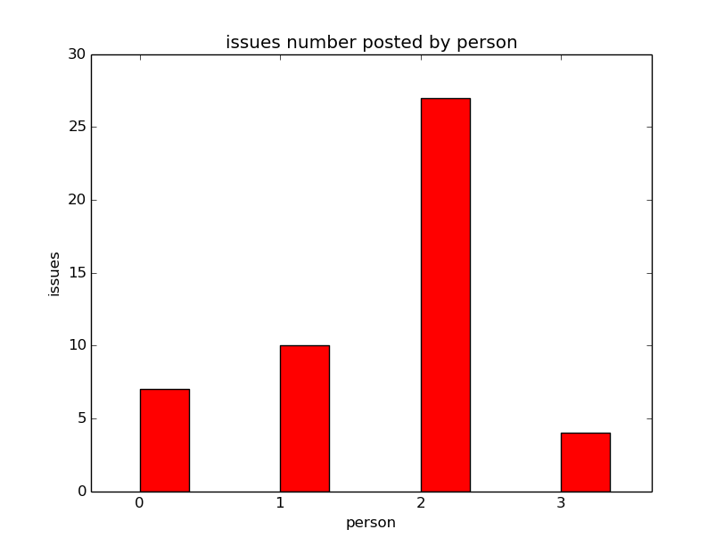 
*Project 2*
    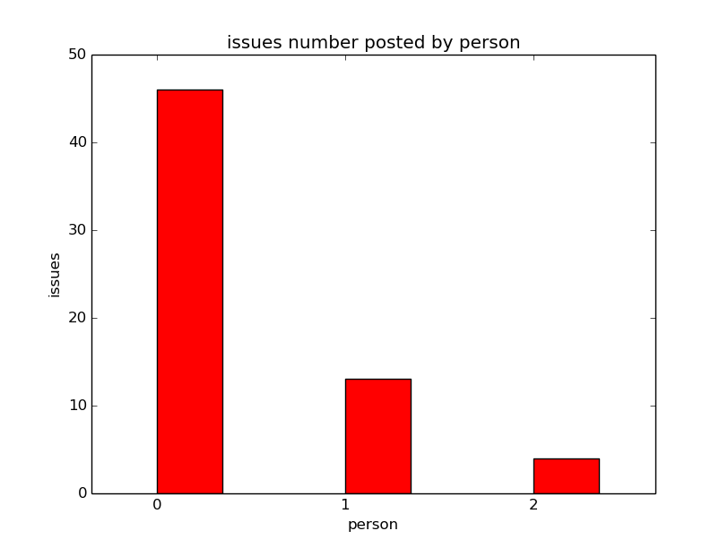 
*Project 3*
    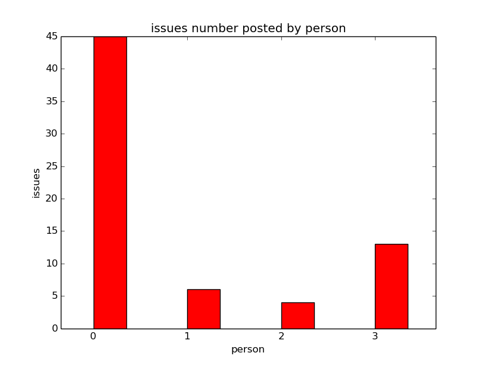 
    
In order to extract the extra large number of issues post by a single user,we used the criteria in [issuesPersondector](/detector/issuesPersonDetector.py)
       
      issues_perosn >= mean + delta*standard_deviation    delta = 1

*project 1*
      large_issues post by single user : person2, issues: 27, percentage: 56.2%

*project 2*
      large_issues post by single user : person0, issues: 46, percentage: 73%

*project 3*
      large_issues post by single user : person0, issues: 45, percentage:66.1%

####8. Small number of issues posted by a single user
Using the above data collected, we also detected extra small number of issues by single user[issuesPersondector](/detector/issuesPersonDetector.py)
       
      issues_person <= mean - delta*standard_deviation    delta = 1

*project 1*
      small_issues post by single user : None

*project 2*
      small_issues post by single user : None

*project 3*
      small_issues post by single user : None 

          
####9. Number of users involved in an issue
We sorted the issues number according to the comments number. 
We also sorted the issues number according to the events number in this issue [issuesCommentsAndEventsDetector](/detector/issuesCommentsAndEventsDetector.py):

*Project 1*
    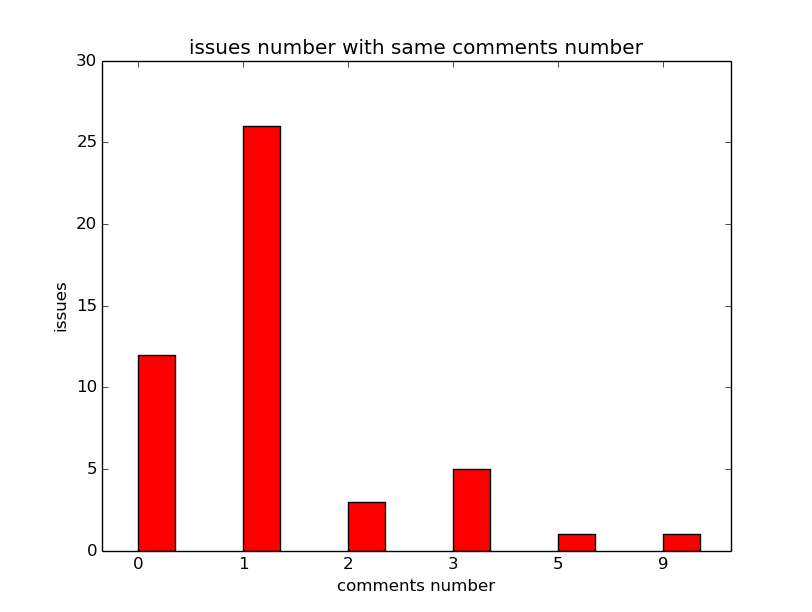  
    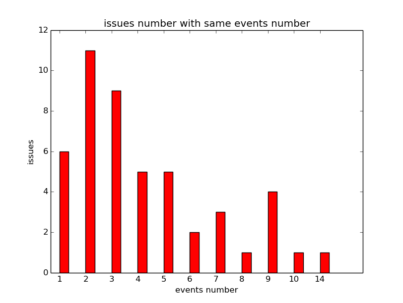   

    1.large issues number  with same comments:
        comments: 1, issues: 27 , percentage: 54.1%
    2.large issues number with same events:
        events: 2, issues: 11, percentage: 22.9%
        events: 3, issues: 9 , percentage: 18.75
*Project 2*
    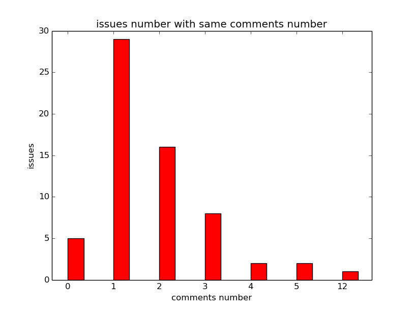  
     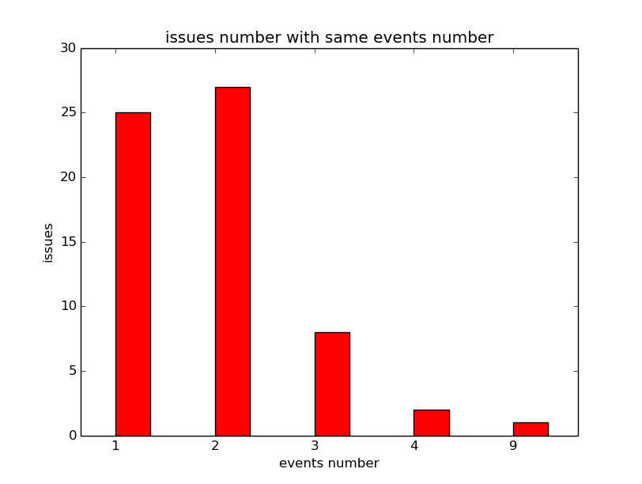   
    
    1.large issues number  with same comments:
        comments: 1, issues: 29 , percentage: 46.0%
    2.large issues number with same events:
        events: 1, issues: 25, percentage: 39.6%
        events: 2, issues: 27 , percentage: 42.8%

*Project 3*
    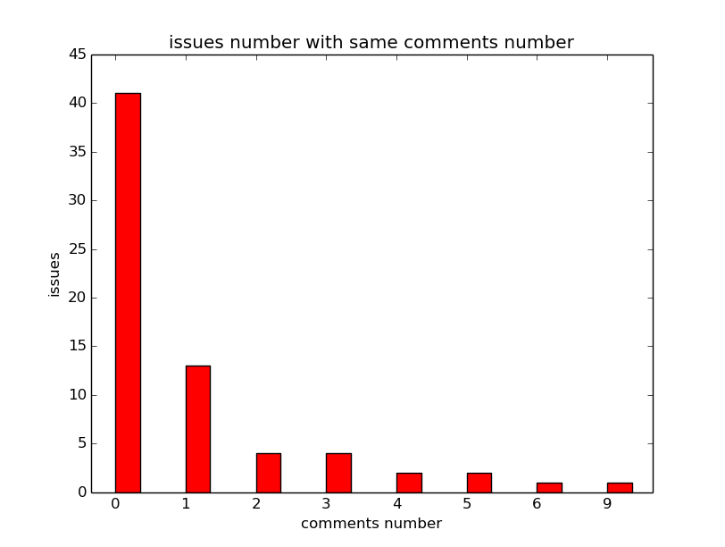  
    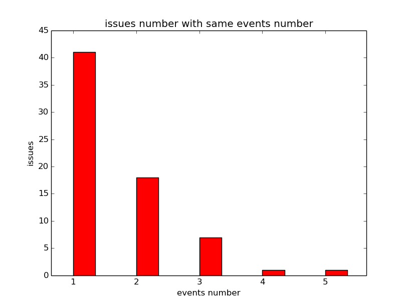   
    
    1.large issues number  with same comments:
        comments: 0, issues: 41 , percentage: 60.3%
    2.large issues number with same events:
        events: 1, issues: 41, percentage: 60.3%

####10. Unusual commits number in a specific time
We group the commits number in a week order and generated the graph as follows :[commitsPersondector](/detector/commitsPersonDetector.py)

*Project 1*
    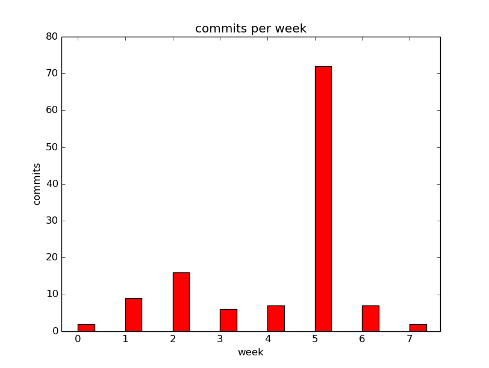  

    1.extra large work during the week: week_5, commits:72
    2.small work during the week:NOne

*Project 2*
    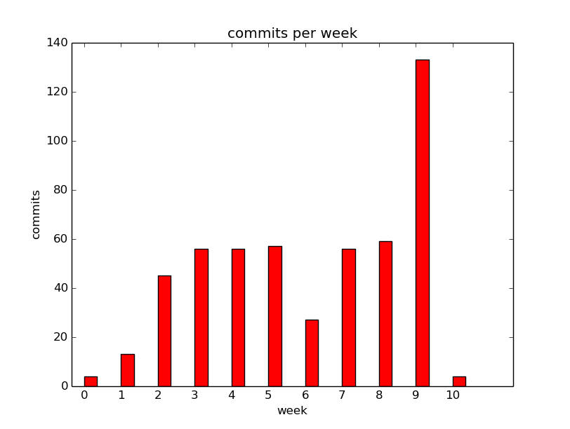  

    1.extra large work during the week: 
        week_9, commits: 133, percentage: 26.1%
    2.small work during the week:NOne
        week_0, commits: 4, percentage: 0.7%
        week_10, commits: 4, percentage: 0.7%

*Project 3*
    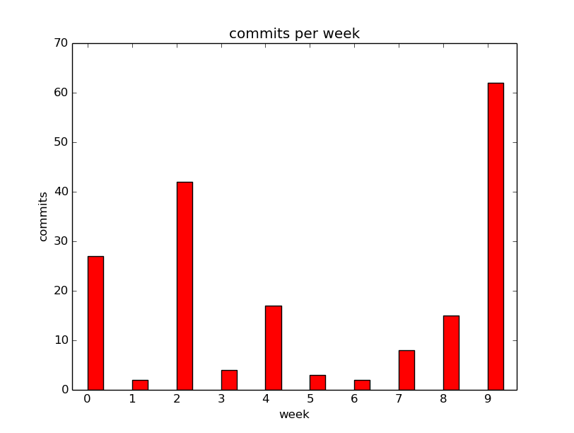  

    1.extra large work during the week:
        week_2, commits: 42, percentage: 23.1%
        week_9, commits: 62, percentage: 34.1%
    2.small work during the week : None

####11. Commits by a single user
We analyze the commits number commited by a single user and generate the graph as follows:[commitsWeekdector](/detector/commitsWeekDetector.py)

*Project 1*
    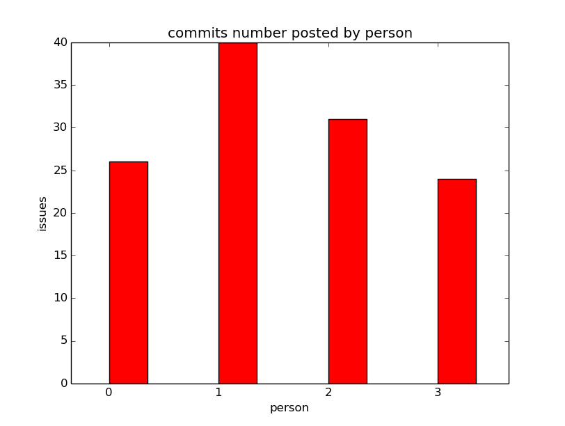  

    1.large commits by single user: None
    2.small commits by single user: None
    
*Project 2*
    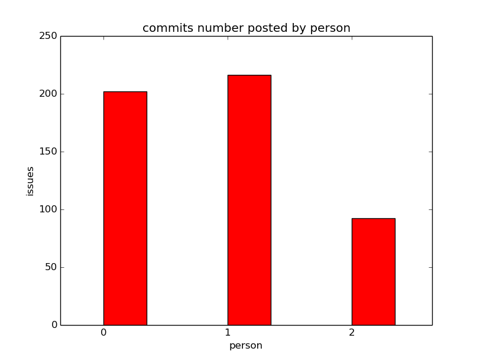  
    
    1.large commits by single user: None
    2.small commits by single user: person2, commits:92, percentage: 18.0%

*Project 3*
    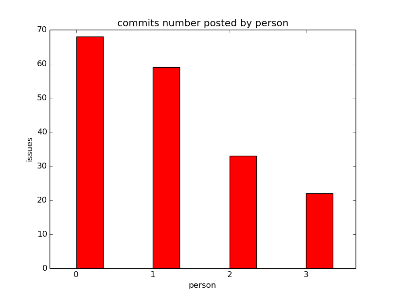  
    
    1.large commits by single user: person0, commits: 68, percentage: 37.3%
    2.small commits by single user: person3, commits: 22, percentage: 12.1%

##  Bad smells detector & Result

###Uneven Contribution Smell Detector
In a project, someone may leading the project and someone could be a passenger with much less contribution to the group.
It may reflect on the issues and commits numbers by user. We conbine the commits and issues detector [unevenContributionDetector](./detector/unevenContributionDetectro.py)
         
         leader: made both extra large issues and commits
         passenger: made both extra small large issues and commits 
         project is uneven contributed:  has both uneven issues and commits 
       

####Result
*Project1*
    Badsmells: None
    
*Project2*
    Badsmells:
       Project might be unevenly contributed
    
*Project3*
    Badsmells:
       Project is leading by someone
       Project is unevenly contributed

###Issue Duration Smell Detector

####Result

###Commit per Person Smell Detector

####Result

###Label Usage Smell Detector

####Result

###Milestone Smell Detector

####Result

###Pull Request Smell Detector

####Result

##  Early warning

##  Early warning results
